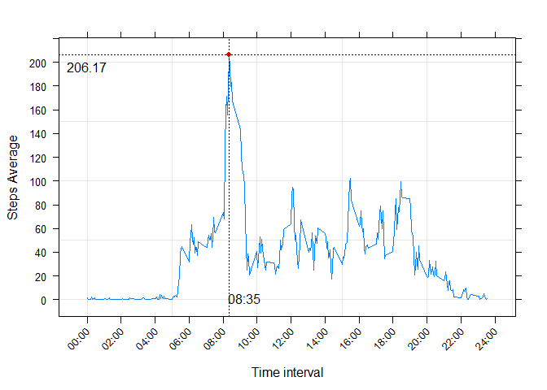
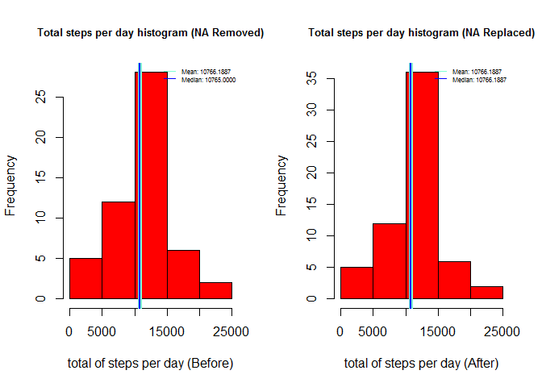
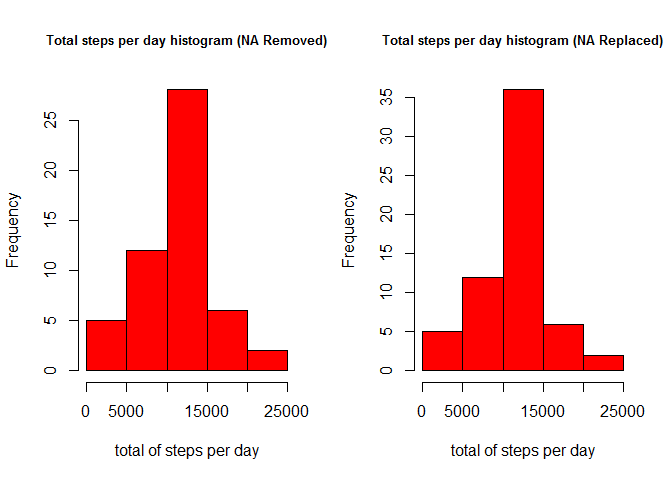
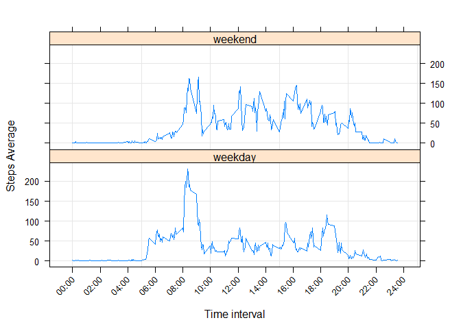

# Reproducible Research: Peer Assessment 1


## Loading and preprocessing the data


The data coming from the measurement of the steps froma a subject from 2 months are loaded into memory.  
Also the class of each variable is given to help in the data process:


```r
#If the file is not present, it would unzipped
if (!file.exists("activity.csv")) {
    unzip("activity.zip")
}
data<-read.csv("activity.csv", colClasses=c("integer","POSIXct","character"))
```

Formating interval column from the dataset to a more readable format. It indicates the Hour (24 format) and minutes, but it is not so clear. In order to be in a more readable measurement, it is given the format HH:mm


```r
data$intervalH<- gsub('^(\\d{2})(\\d+)$', '\\1:\\2',  sprintf("%04d",as.numeric(data$interval)))
```

## What is mean total number of steps taken per day?

The missing values are removed in order to process the total number of steps found in the measurements:


```r
dataStepsClean<-data[!is.na(data$steps),]
```


The total steps per day is calculated:


```r
dayStepTotal<-tapply(dataStepsClean$steps, dataStepsClean$date,sum)
```


The corresponding Histogram for the total steps per days:


```r
hist(dayStepTotal, col="red", xlab="total of steps per day", main="Total steps per day histogram")
```

 


Calculate the Mean and Median for the total step count per day


```r
stepsMean <-as.character(mean(dayStepTotal))
stepsMedian<- as.character(median(dayStepTotal))
```

The resulting **Mean** is: **10766.1886792453** and the **Median** is: **10765**

## What is the average daily activity pattern?


The avarage of the steps in each time interval across the days is calculated:


```r
intervalStepMeans1<- setNames(aggregate(steps~as.numeric(interval),dataStepsClean, mean),c("interval","steps"))
intervalStepMeans<-tapply(dataStepsClean$steps, dataStepsClean$intervalH,mean)
```


A timeline graphic is created to see the Step Mean during the time intervals. Lattice plotting is used:


```r
library(lattice)
#Formating x scale
xscale.components.custom = function(...) {
     ans <- xscale.components.default(...)
     ans$bottom$labels$labels <- gsub('^(\\d{2})(\\d+)$', '\\1:\\2',sprintf("%04d", ans$bottom$labels$at))
     ans
}
xyplot(steps~interval, data=intervalStepMeans1, type=c("l","g"), layout = c(1,1),scales = list(x=list(rot = 45,abbreviate=FALSE,tick.number=10),y=list(tick.number=10)), xscale.components = xscale.components.custom, xlab="Time interval",ylab="Steps Average")
```

 

```r
#plot(intervalStepMeans,xaxt="n", type="l", ylab="Step Mean",xlab="Time Interval", col="blue")
#axis(1,at=1:length(names(intervalStepMeans)),labels=names(intervalStepMeans))
```


The maximum mean and interval is obtained:


```r
maxStepMean<-max(intervalStepMeans)
intervatWithMaxMean<-names(intervalStepMeans)[intervalStepMeans==maxStepMean]
```

The maximum **Step Mean** is:  **206.1698**, found at **Time Interval** : **08:35**


## Imputing missing values


Calculating missing values


```r
missingValues<- sum( is.na(data$steps))
```


In the dataset were found **2304** values. In order to replace the missing values, it will be used the Mean value for each time interval.


```r
data2<-as.data.frame(t(apply(data,1,FUN=function(x){
  if(is.na(x["steps"])){
      x["steps"]<-as.numeric(intervalStepMeans[x["intervalH"]])
    }
    x
  })), stringsAsFactors=FALSE)
#Since all the columns are returned as strings, the steps are converted to numeric values
#Also the date is transformed into a POSIXlt value
data2<-transform(data2, steps = as.numeric(steps),date=strptime(date,"%Y-%m-%d"), interval = as.numeric(interval))
```

in order to verify how the completion of the missing values affects the data behavior, 
the total steps per day metrics are repeated  

The histogram of the new dataset with NA values replaced against the previous Histogram where the NA were removed:


```r
#Calculating the new total steps per day
dayStepTotal2<-tapply(data2$steps, as.character(data2$date),sum)

par(mfrow=c(1,2))
#Plotting the previous histogram
hist(dayStepTotal, col="red", xlab="total of steps per day", main="")
title(main = list("Total steps per day histogram (NA Removed)", cex = 0.8))
#plotting the new Histogram
hist(dayStepTotal2, col="red", xlab="total of steps per day", main="")
title(main = list("Total steps per day histogram (NA Replaced)", cex = 0.8))
```

 

While the mean and median


```r
#Returning the plot configuration
par(mfrow=c(1,1))
#Calculating the mean and median of the new dataset
stepsMean2 <-as.character(mean(dayStepTotal2))
stepsMedian2 <- as.character(median(dayStepTotal2))
```

Results in **Mean** is: **10766.1886792453** and the **Median** is: **10766.1886792453**  

Performing a comparison against the previous values obtained:

| Dataset                | Mean             |Median             |
| -----------------------|----------------- | ----------------- |
| **NA Removed (Prev)**  | *10766.1886792453*  | *10765* |
| **NA Replaced (New)**  | *10766.1886792453* | *10766.1886792453*|


There are no variation regarding the mean value, but the Histogram and the Median were slightly modified.


## Are there differences in activity patterns between weekdays and weekends?


For each observation, it is identified if the day is at weekend (Satuday or Sunday), o at weekday (Monday-Friday)  


```r
#A new Column is added. this column is factor with two levels: "weekend" and "weekday"
data2<-transform(data2, dayType=as.factor(sapply(date$wday, FUN =function(x){
    if(x %in% c(0,6)){"weekend"}else{"weekday"} 
  } )))
```


The mean values for each day type at every interval is calculated


```r
data3<-aggregate(steps~dayType+interval, data2,mean)
```


The comparison between weekdays and weekend regarding the mean of the steps for each interval will be done using lattice plotting library


```r
#plotting
xyplot(steps~interval|dayType, data=data3, type=c("l","g"), layout = c(1,2),scales = list(x=list(rot = 45,abbreviate=FALSE,tick.number=10)), xscale.components = xscale.components.custom, xlab="Time interval",ylab="Steps Average")
```

 


